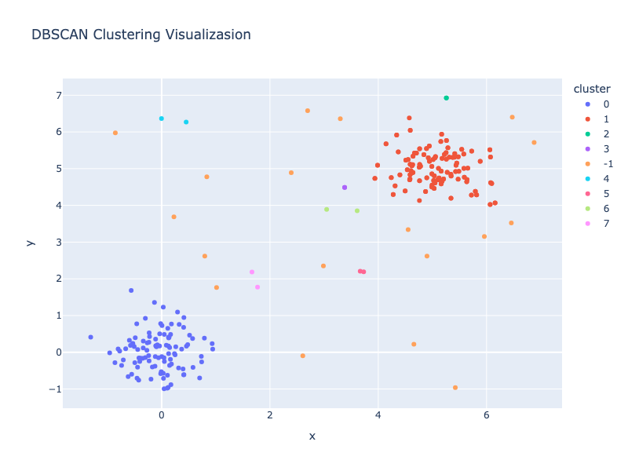
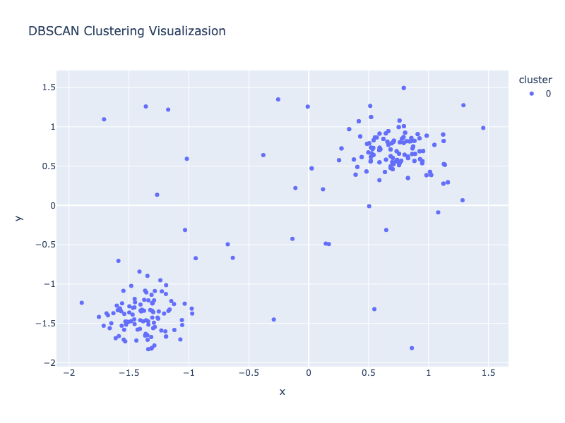
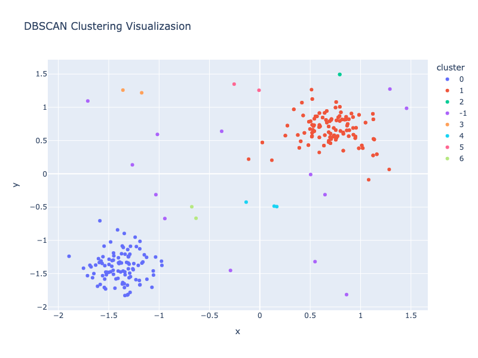
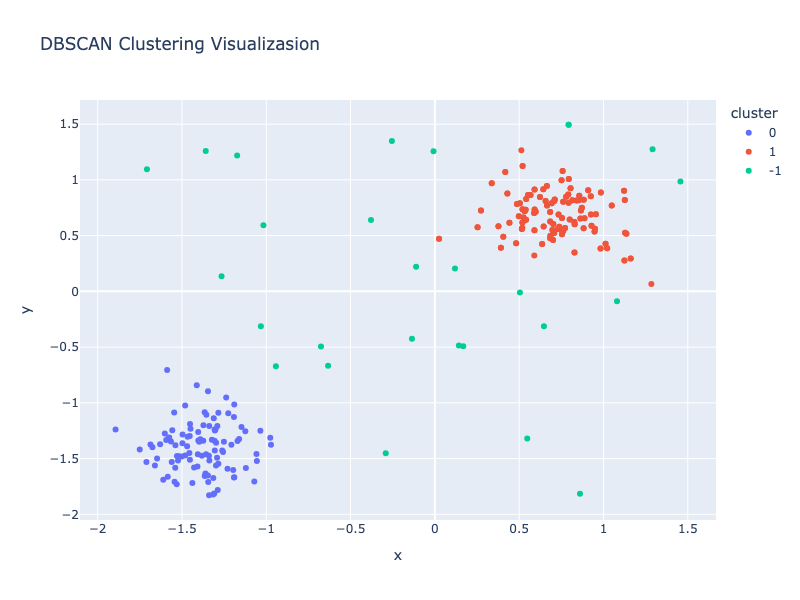
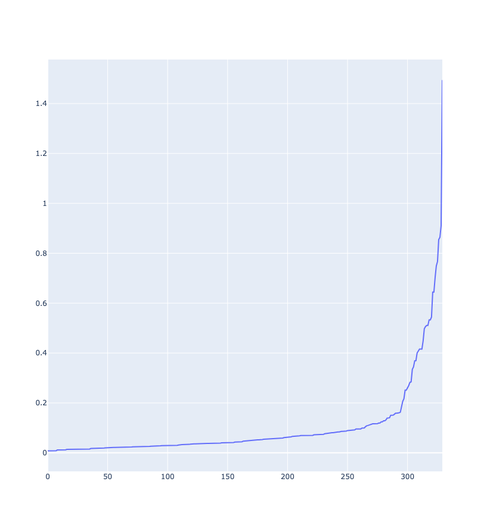
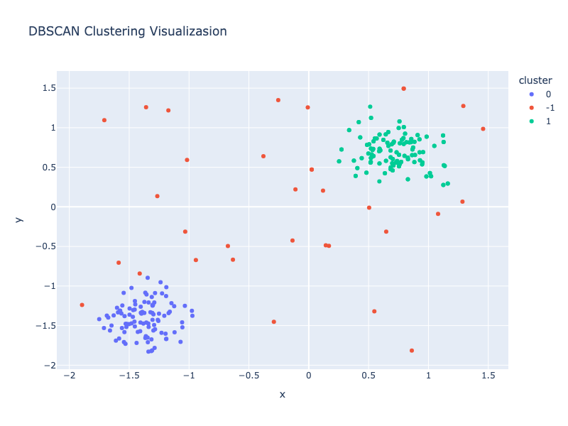

### DBSCAN Clustering Visuallization PoC

#### 🎯 目的
DBSCANのクラスタリングの様子を、パラメータep, min_samplesの値を変化させ、  
視覚的に確認すること

#### 📝 仮説
##### ep
1. 小さくする⇒　クラスタ数が増える
1. 大きくする⇒　クラスタ数が減る

##### min_samples
1. 小さくする⇒　クラスタ数がかなり増える
1. 大きくする⇒　クラスタ数がかなり減る

--- 

### 🏁 結果と考察
1. ベースライン

1. ep: 小  
密度を小さく見ることなので、意味のないクラスタが増える  

1. ep: 大  
密度を大きく見ることなので、クラスタの意味がなくなる  

1. num_samples: 小  
クラスタ形成最小数パラメータなので、意味のないクラスタが形成される  

1. num_samples: 大
クラスタ形成最小数パラメータなので、ベースラインより大きくしても特に変化なし  

### 🖊️ 考察  
epとmin_samplesは、小さめにしないと異常検知には使用出来ない  

### 🔬 実験  
#### パラメータ構成として、k-distanceグラフでepsを決める  
下記グラフを見るとエルボーは0.17くらい⇒ 0.17より大きいとノイズ(外れ値)との距離が急激に広がる

##### eps=0.3の場合  

##### eps=0.17の場合  
上記より適切にクラスタリングされている  
